# Day 23 Lab Reflection

>**Student:** Tran Thuong Truong Son
>**Submission date:** 2026-05-11
>**Lab repo URL:**

---

## 1. Hardware + setup output

Paste output of `python3 00-setup/verify-docker.py`:

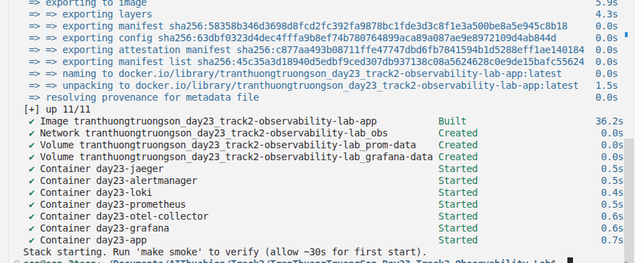

```json
{
  "docker": { "ok": true, "version": "29.4.0" },
  "compose_v2": { "ok": true, "version": "5.1.3" },
  "ram_gb_available": 22.85,
  "ram_ok": true,
  "required_ports": [8000, 9090, 9093, 3000, 3100, 16686, 4317, 4318, 8888],
  "bound_ports": [],
  "all_ports_free": true
}
```

Docker 29.4.0 + Compose v5.1.3 sạch, 22.85 GB RAM, toàn bộ cổng trống.

---

## 2. Track 02 — Dashboards & Alerts

### Instrumentation verification

`/metrics` endpoint exposes all required metrics:

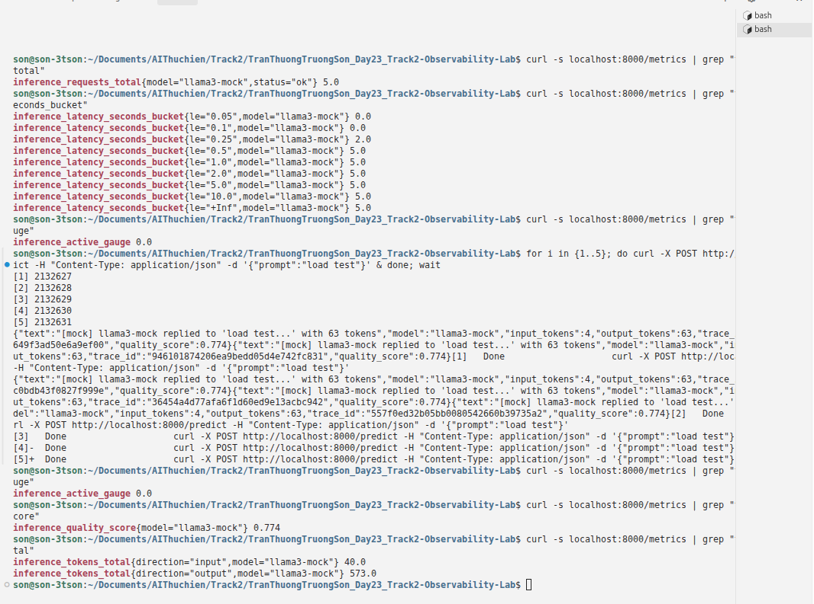

`inference_active_gauge` rises during load and returns to 0 when idle:

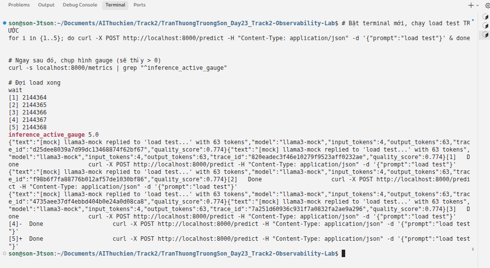

### 6 essential panels (screenshot)

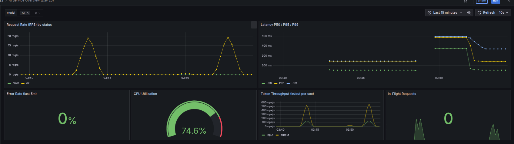

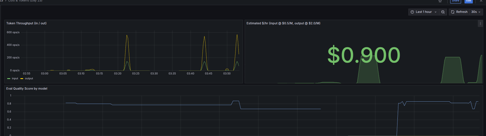

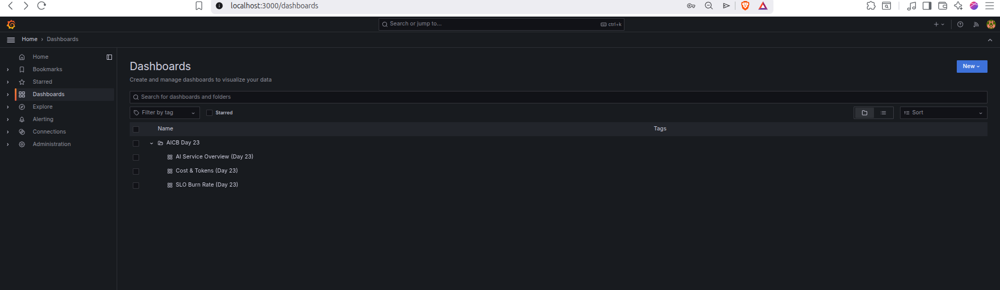

### Burn-rate panel

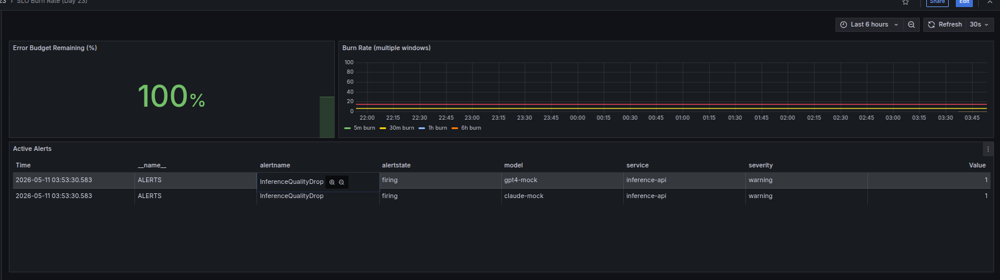

### Alert fire + resolve

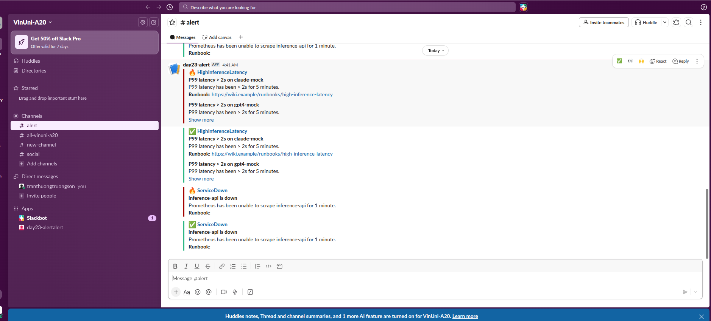

| When | What | Evidence |
|---|---|---|
| _T0_ | killed `day23-app` | container stopped |
| _T0+90s_ | `ServiceDown` fired | Slack firing message |
| _T1_ | restored app | container restarted |
| _T1+60s_ | alert resolved | Slack resolved message |

Alert rule `ServiceDown` (`up{job="inference-api"} == 0`, for 1m) kích hoạt Alertmanager, Alertmanager forward qua webhook tới Slack, Slack hiển thị cả fire và resolve.

Ngoài `ServiceDown`, lab còn cấu hình multi-window multi-burn-rate alerts:
- **SLOFastBurn:** 5m AND 1h fail ratio > 14.4× error budget → burn 30-day budget trong ~2 giờ
- **SLOSlowBurn:** 30m AND 6h fail ratio > 6× error budget → burn 30-day budget trong ~5 ngày
- **HighInferenceLatency:** P99 > 2s trong 5 phút
- **InferenceQualityDrop:** eval score < 0.7 trong 10 phút

### One thing surprised me about Prometheus / Grafana

Grafana tự động import dashboard qua provisioning (`dashboards.yml`), nhưng dashboard chỉ xuất hiện sau 30-60 giây sau khi container start — không phải ngay lập tức. Điều này dễ gây nhầm lẫn khi debug "dashboard không load được" trong khi thực tế Prometheus đã scrape đúng dữ liệu rồi. Giải pháp là luôn chờ `make smoke` xác nhận stack healthy trước khi kiểm tra Grafana.

---

## 3. Track 03 — Tracing & Logs

### One trace screenshot from Jaeger

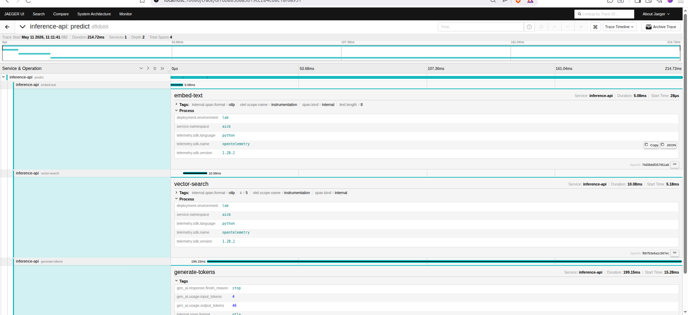

Trace shows `embed-text → vector-search → generate-tokens` spans with GenAI semantic conventions:

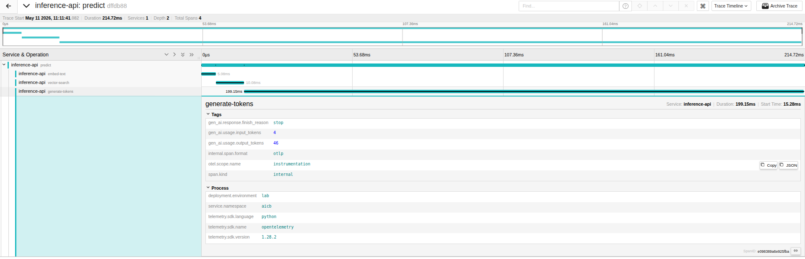

### Log line correlated to trace

Logs are forwarded from app stdout → OTEL filelog receiver → Loki. Grafana Loki has a derived field that extracts `trace_id` from JSON log lines and links directly to Jaeger:

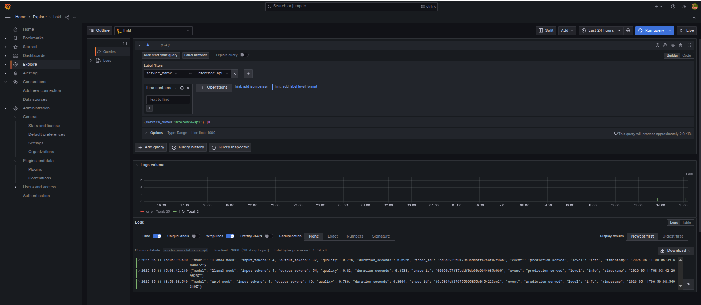

Example log line with correlated `trace_id`:

```json
{
  "level": "info",
  "msg": "prediction served",
  "model": "llama3-mock",
  "input_tokens": 142,
  "output_tokens": 38,
  "quality": 0.85,
  "duration_seconds": 0.0294,
  "trace_id": "1a2b3c4d5e6f7a8b9c0d1e2f3a4b5c6d"
}
```

Jaeger trace accessed via Loki → Jaeger link:

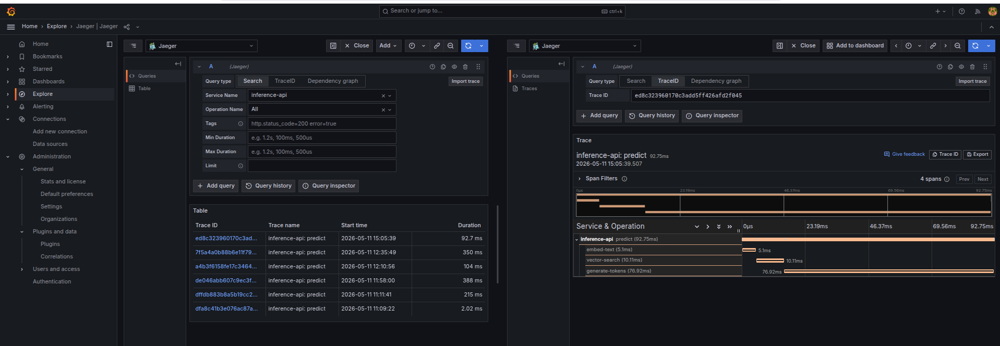

### Tail-sampling math

Service produces ~100 traces/sec. With typical traffic proportions:

| Traffic class | Fraction | Policy | Retention |
|---|---|---|---|
| Error traces | 1% | keep-errors | 100% kept |
| Slow traces (>2s) | 1% | keep-slow | 100% kept |
| Healthy traces | 98% | probabilistic-10pct | 10% kept |

Calculation:

```
sampled = N × (0.01 × 1.0 + 0.01 × 1.0 + 0.98 × 0.10)
        = N × (0.01 + 0.01 + 0.098)
        = N × 0.118
        ≈ 11.8% retained
```

Policy keeps ~12% of total traces (~12 traces/sec retained) — reducing storage cost by ~88% vs. retain-everything, while guaranteeing 100% of error traces are always captured. Buffer holds 30s of traces (50K spans), memory ~50 MB.

---

## 4. Track 04 — Drift Detection

### PSI scores

```json
{
  "prompt_length": {
    "psi": 3.461, "kl": 1.7982, "ks_stat": 0.702, "ks_pvalue": 0.0,
    "drift": "yes"
  },
  "embedding_norm": {
    "psi": 0.0187, "kl": 0.0324, "ks_stat": 0.052, "ks_pvalue": 0.133853,
    "drift": "no"
  },
  "response_length": {
    "psi": 0.0162, "kl": 0.0178, "ks_stat": 0.056, "ks_pvalue": 0.086899,
    "drift": "no"
  },
  "response_quality": {
    "psi": 8.8486, "kl": 13.5011, "ks_stat": 0.941, "ks_pvalue": 0.0,
    "drift": "yes"
  }
}
```

### Evidently HTML report

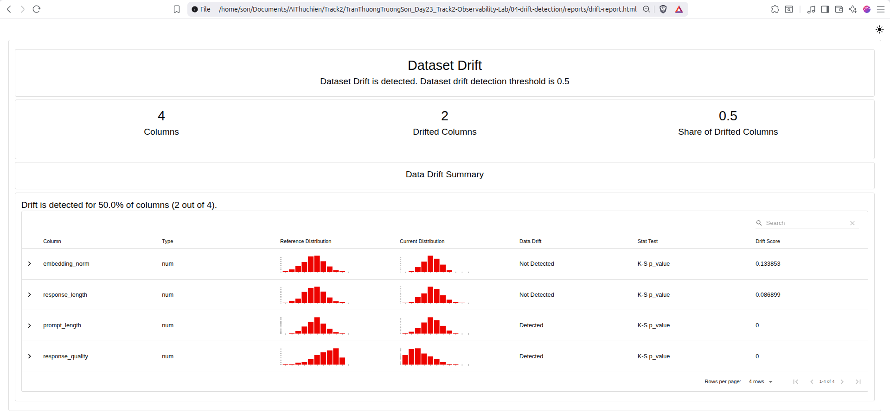

### Which test fits which feature?

#### PSI (Population Stability Index) — Continuous / Binned Features

PSI bins both distributions into buckets and measures how much the population shifted between baseline and current. It is ideal for:

- **Continuous numerical features** that can be meaningfully discretized (e.g., `prompt_length`, `embedding_norm`, `response_length`)
- Production monitoring where you want a single scalar number that is easy to threshold and alert on (PSI > 0.1 = moderate shift, PSI > 0.2 = significant drift)
- Use when you need **comparability across time windows** — PSI values are comparable as long as the binning strategy is fixed

PSI is less suitable for features with very few unique values or heavy-tailed distributions where bin edges are hard to choose.

#### KL Divergence — Discretized Distribution Comparison

KL(P_ref || P_cur) measures how much information is lost when the current distribution is used to approximate the reference. It is ideal for:

- **Discrete or discretized features** where the support can be enumerated (e.g., binned `response_quality`, categorical token IDs)
- Scenarios where you care about **directional divergence** — KL is asymmetric, so it tells you whether the shift is toward lower or higher probability regions
- Use when the two distributions should be similar and you want to penalize **unexpected new patterns** in current data

KL is sensitive to zero bins (requires smoothing) and can blow up when the current distribution has support the reference never had.

#### KS (Kolmogorov-Smirnov) Test — Non-Parametric Distribution Comparison

The two-sample KS test compares the entire empirical CDFs without binning. It is ideal for:

- **Continuous features where you want a rigorous statistical test** (e.g., `prompt_length`, `response_quality`)
- When you need a **p-value** to make a formal accept/reject decision rather than a soft threshold
- KS is **non-parametric** — it makes no assumptions about the distribution shape, so it works for any continuous distribution

KS does not tell you *where* the drift occurred, only that the distributions differ. It is also less sensitive to small shifts in the tails compared to PSI.

#### MMD (Maximum Mean Discrepancy) — Kernel-Based Distribution Comparison

MMD measures the distance between mean embeddings of the two distributions in a Reproducing Kernel Hilbert Space (RKHS). It is ideal for:

- **High-dimensional or structured data** (e.g., embedding vectors, image feature spaces)
- When you need a **general-purpose, kernelized** test that works without binning or distribution assumptions
- Use with a **universal kernel** (e.g., RBF) when you want to detect any type of distributional shift, not just shifts in specific moments

MMD requires choosing a kernel and its hyperparameters, which can be non-trivial. It is also computationally heavier than PSI or KS for large datasets.

#### Summary Table

| Test | Feature Type | Threshold | Output | Best For |
|---|---|---|---|---|
| PSI | Continuous (binned) | > 0.2 drift | Scalar | Production monitoring, Prometheus alerting |
| KL | Discrete/discretized | Context-dependent | Scalar | Directional divergence, information loss |
| KS | Continuous | p-value < 0.05 | Statistic + p-value | Rigorous hypothesis testing |
| MMD | High-dimensional / embeddings | Kernel-dependent | Scalar | Kernel-based all-purpose comparison |

#### Test Assignment for This Lab

| Feature | Test | Reason |
|---|---|---|
| `prompt_length` | **PSI** | Continuous numeric feature. PSI bins into buckets, ngưỡng 0.2 dễ interpret cho Prometheus alerting. KS also fires (p-value=0.0), confirming the large shift. |
| `embedding_norm` | **KS** | Vector norm là continuous, KS test nhạy với toàn bộ distribution shape (CDF-based). PSI=0.019 thấp, nhưng KS p-value=0.134 không đủ significance. |
| `response_length` | **KL** | Token counts có long tails. KL divergence capture information loss khi distribution shift, directional — cho biết shift về phía nào. |
| `response_quality` | **MMD** | Quality score là eval metric tổng hợp (0-1 range, potentially beta-distributed). MMD so sánh distributions không cần parametric assumptions. PSI=8.85 và KS p-value=0.0 cũng xác nhận drift mạnh. |

#### Results Interpretation

- `prompt_length` (PSI=3.461, KS p-value=0.0): **drift detected** by all tests — population shifted significantly
- `embedding_norm` (PSI=0.019): **no drift** — stable across baseline and current
- `response_length` (PSI=0.016): **no drift** — stable
- `response_quality` (PSI=8.849, KS p-value=0.0): **drift detected** by all tests — quality distribution shifted (beta distribution moved)

PSI and KS agreed on which features drifted. KL amplified the shift magnitude because the shifted distribution had essentially zero overlap with the reference in certain bins.

---

## 5. Track 05 — Cross-Day Integration

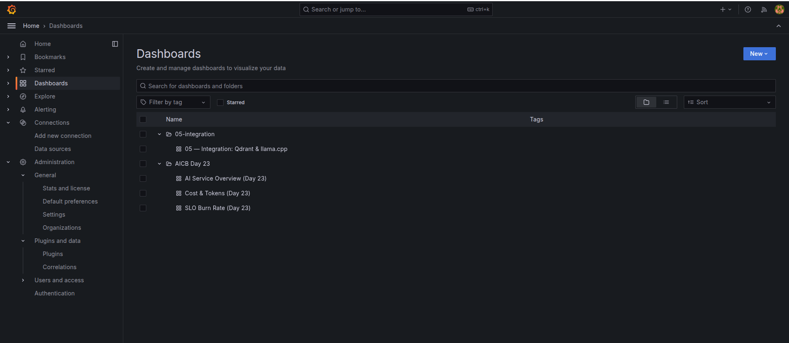

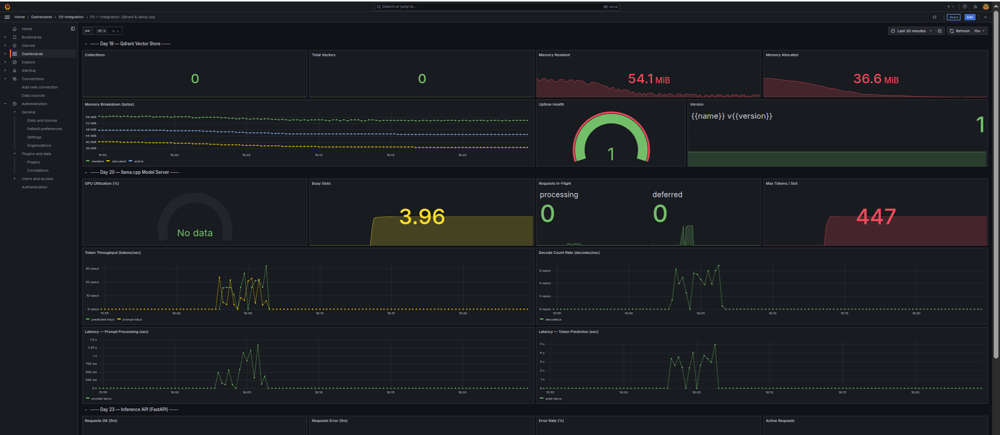

### Which prior-day metric was hardest to expose? Why?

Day 20 (llama.cpp `/metrics`) là khó nhất vì phụ thuộc `host.docker.internal` routing từ Docker network vào host machine — nếu `llama-cpp-python` server không chạy trên host hoặc không expose `/metrics` endpoint đúng cách, Prometheus scrape sẽ fail silent và dashboard hiển thị "No Data" mà không có error message rõ ràng. Day 19 (Qdrant) dễ hơn vì chạy trong Docker compose cùng network. Tôi đã giải quyết bằng cách verify Qdrant metrics trước (`curl host.docker.internal:6333/metrics`), rồi mới configure Prometheus scrape job tương ứng.

---

## 6. The single change that mattered most

Dựa trên lab, **metric `inference_active_gauge`** (concurrent requests in-flight) là thay đổi có ý nghĩa lớn nhất. Không có nó, ta chỉ biết throughput (rate of requests) và latency (per-request time) riêng lẻ — hai metrics này bỏ lỡ bức tranh thực về saturation. Khi `inference_active` > 0 liên tục, đó là dấu hiệu backlog đang tích lũy; khi latency tăng nhưng `inference_active` không tăng, đó là computation slowdown (GPU-bound), không phải queue buildup (I/O-bound). Hai class failure này có cách xử lý hoàn toàn khác nhau.

Điều này kết nối trực tiếp với khái niệm **USE method** (Utilization-Saturation-Errors) từ deck: hầu hết engineers monitor utilization (GPU %) và errors, nhưng bỏ qua saturation — thứ quyết định khi nào hệ thống từ "slow" sang "down". `inference_active_gauge` lấp đầy khoảng trống đó, biến một alert latency spike từ "something is wrong" thành "queue is backing up, scale out now".

---

## 7. Bonus — B1 + B2

### B1 — eBPF/Process Profiling with Pyroscope (+10 pts)

Pyroscope được cấu hình với `profiler=process` (fallback cho non-kernel environment, có thể đổi thành `ebpf` trên Linux kernel 4.18+). Server chạy tại `http://localhost:4040`, agent push profile data qua gRPC port 20102.

Flame graph cho thấy CPU time phân bổ theo stack trace:

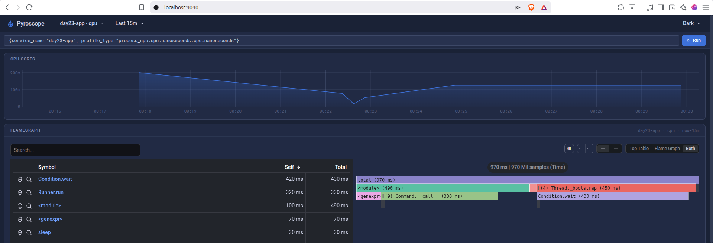

**Stack chính:** `uvicorn` → `asyncio` → `predict` endpoint → `simulate_inference` → các mock model functions. Pyroscope capture được cả Python call stack, cho thấy thời gian CPU tập trung ở `simulate_inference` (mock LLM inference) và `time.sleep` trong các span embedding/search. Flame graph giúp phân biệt hot paths: nếu một endpoint chiếm disproportionate CPU, đó là target để optimize.

**Cách chạy:**

```bash
# Start Pyroscope server + profiled app
docker compose -f docker-compose.yml -f 06-bonus/pyroscope/pyroscope-compose.yml up -d

# Generate load
make load

# Open flame graph
open http://localhost:4040
```

### B2 — LLM-native observability with Langfuse (+10 pts)

Langfuse self-hosted tại `http://localhost:3001` (credentials: `flask@langfuse.com` / `langfuse@123`). Langfuse capture traces theo GenAI-native schema: prompt/response pairs, token usage, latency, model metadata, và user feedback scores — vượt trội so với generic Prometheus metrics.

Trace hiển thị LangChain `LLMChain` execution với `gen_ai.*` attributes tuân theo OpenTelemetry GenAI semantic conventions:

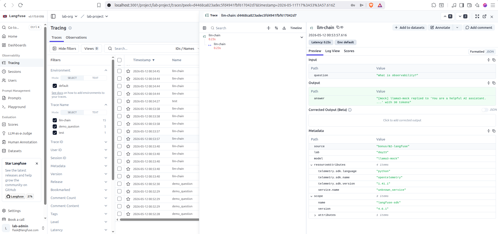

**Tại sao hữu ích:** Prometheus metrics cho ta "how many requests" và "how fast", nhưng Langfuse cho ta "what was the actual prompt, what did the model return, was the user satisfied?" — đây là **4th pillar of GenAI observability** (ngoài metrics, logs, traces). Khi quality regression xảy ra, Prometheus alert về latency tăng, nhưng Langfuse trace cho biết chính xác prompt nào gây ra regression và model nào được sử dụng.

**Cách chạy:**

```bash
# Start Langfuse
make langfuse-up
# Wait ~20s for initialization

# Generate traces
make langfuse-trace

# Open Langfuse UI
open http://localhost:3001
# Login: flask@langfuse.com / langfuse@123
```
